# 🔐 Blockchain-Based Identity Verification System (ZKP Simulation)

## 🌐 Live Demo

🚀 **Try the application live:**  
👉 https://zkp-blockchain-identity-system.onrender.com/

📌 You can:
- Verify users using ID (PAN/Aadhaar simulation)
- View blockchain audit trail
- Use dashboard filters (Verified / Failed)
- Search users or hash records

## 🚀 Highlights

- 🔐 Zero-Knowledge Proof (ZKP) based identity verification simulation
- ⛓️ Custom blockchain implementation with tamper detection
- 💾 Persistent blockchain using SQLite database (DB ↔ Chain sync)
- 📊 Interactive dashboard with analytics and filtering
- 🔍 Search functionality (by user name and hashed identity)
- 📥 CSV export for blockchain records
- 🌐 REST API for blockchain data access
- 🎨 Modern UI with animations and real-time feedback
- 🔐 Admin login simulation for controlled dashboard access

## 📌 Overview

This project is a **blockchain-based identity verification system** that simulates **Zero-Knowledge Proof (ZKP)** logic for secure KYC validation.

It enables identity verification (PAN/Aadhaar simulation) **without exposing sensitive data**, while maintaining a **tamper-proof blockchain ledger** with a real-time dashboard and API support.

## 🚀 Key Features

### 🔗 Blockchain System
- Custom blockchain implementation using Python
- Each block stores hashed identity, proof, and metadata
- Cryptographic linkage using `previous_hash`
- Tampering detection using blockchain validation

### 🔐 Identity Verification (ZKP Simulation)
- Secure identity validation without exposing raw data
- Supports:
  - Aadhaar (12-digit validation)
  - PAN (format validation)
- Handles:
  - Underage verification failure
  - Invalid ID formats

### 📊 Dashboard & Analytics
- Full blockchain transaction history
- Filters:
  - Verified users
  - Failed verifications
- Search by:
  - User name
  - Identity hash
- Metrics:
  - Total users
  - Verified / Failed count
  - Success rate
- Interactive charts using Chart.js

### 🌐 API Support
- Endpoint: `/api/blocks`
- Returns blockchain data in JSON format

### 📥 Data Export
- Export blockchain records as CSV

### 🎨 UI/UX Enhancements
- Smooth animations and transitions
- Interactive blockchain blocks
- Copy-to-clipboard for hashes
- Loading feedback during verification
- Clean and modern UI design

### 🔐 Login Simulation
- Admin login interface with demo credentials
- Controls access flow to dashboard *(simulation only)*

## 🧠 System Flow

User Input → Validation → Hashing → Blockchain → Database → Dashboard/API

## ⚙️ Tech Stack

| Layer            | Technology |
|-----------------|-----------|
| Backend         | Flask (Python) |
| Database        | SQLite |
| Frontend        | HTML, CSS, JavaScript |
| Visualization   | Chart.js |
| Deployment      | Render |
| Version Control | GitHub |

## 🔐 Blockchain Logic

Each block contains:
- Index
- Timestamp
- Hashed identity
- Proof (`VALID_USER` / `INVALID`)
- Previous hash

### Security Features
- SHA-256 hashing ensures data integrity
- Structured hashing using JSON-based block data
- Blockchain validation detects tampering

## 🆕 Enhancements Implemented

- Persistent blockchain using database synchronization *(DB → chain on startup)*
- Strong hashing using SHA-256 with full block structure
- Improved dashboard filtering and sorting logic
- UI/UX enhancements for better user experience
- Structured login simulation with demo credentials

## 🧪 Sample Test Cases

| Name      | Age | ID            | Result |
|----------|-----|---------------|--------|
| Priscilla | 22  | ABCDE1234F    | ✅ Verified |
| Rahul     | 25  | 123456789012  | ✅ Verified |
| Riya      | 16  | ABCDE1234F    | ❌ Underage |
| Sam       | 30  | 123           | ❌ Invalid ID |

## 📸 Screenshots

📌 Below are key UI screens demonstrating the system workflow and features:

### 🏠 Home Page (Verification Form)
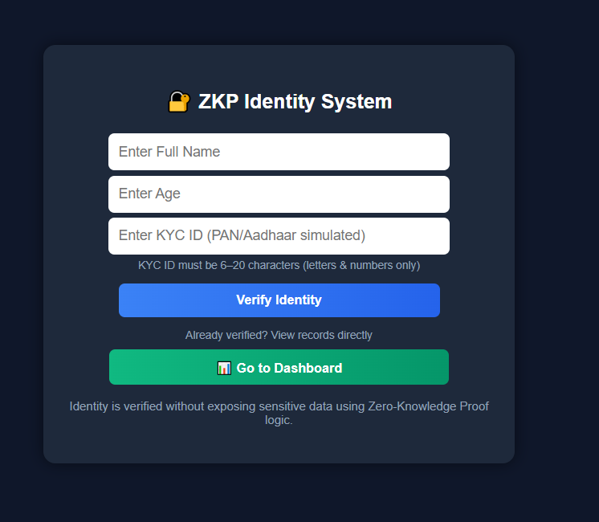

### ✅ Verification Result + Blockchain Audit
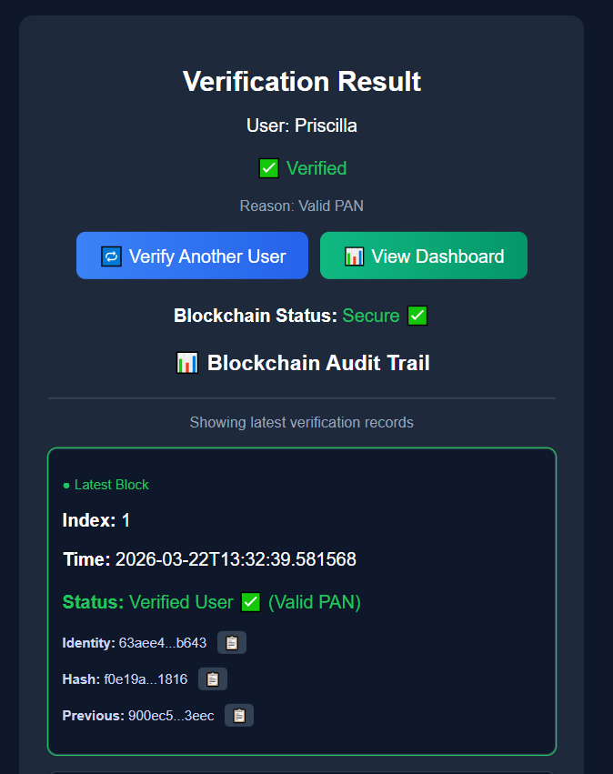

### 🧱 Genesis Block (Blockchain Initialization)
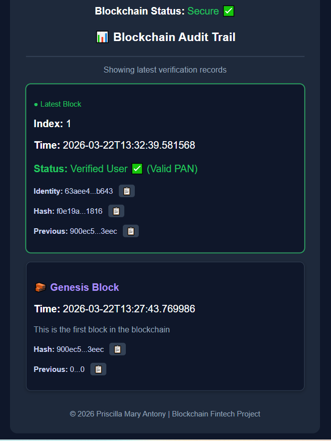

### 📊 Dashboard Overview
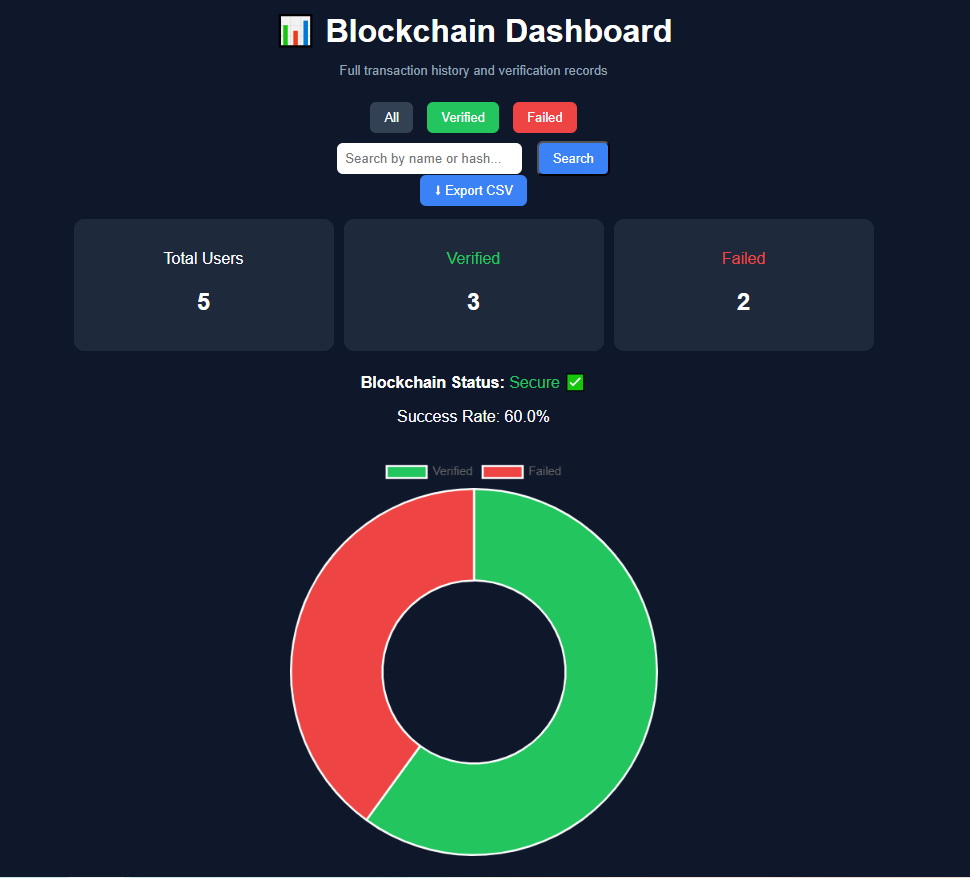

### 📊 Dashboard Blocks View
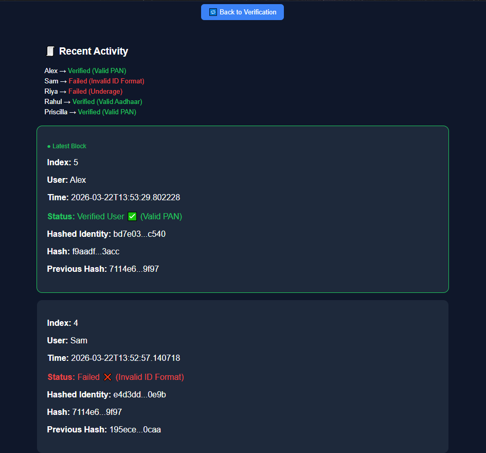

### 🎯 Dashboard Filter (Verified Overview)
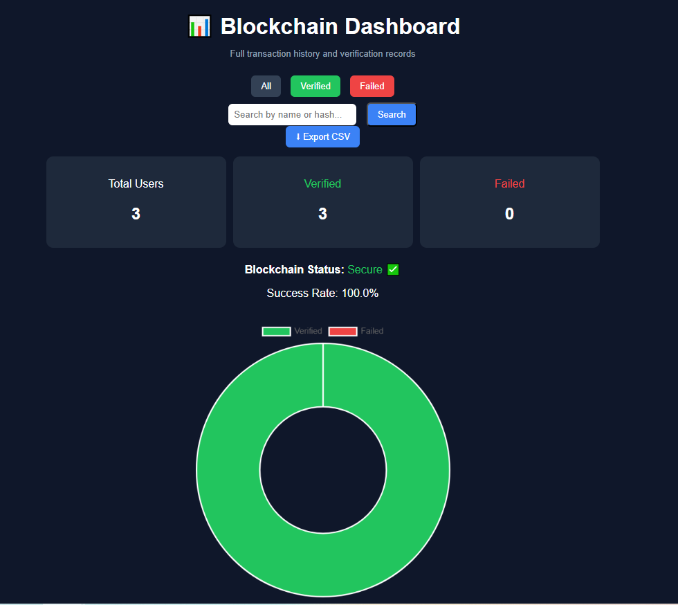

### 🎯 Dashboard Filter (Verified Blocks)
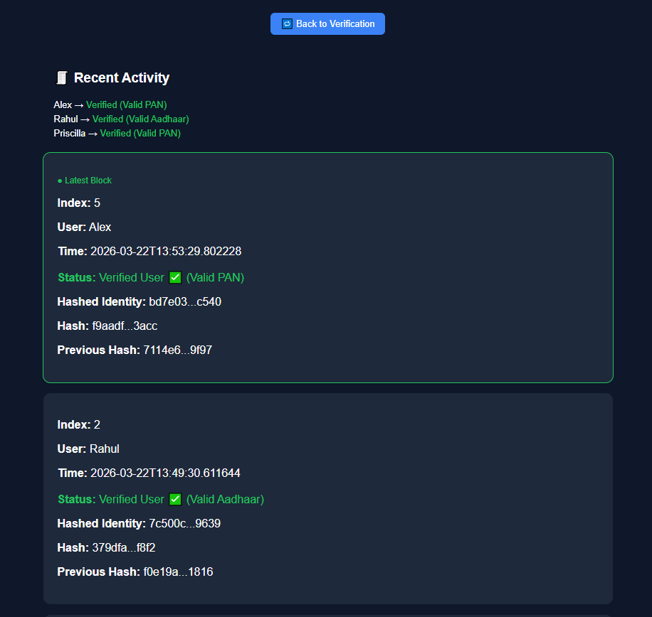

### ❌ Dashboard Filter (Failed Overview)
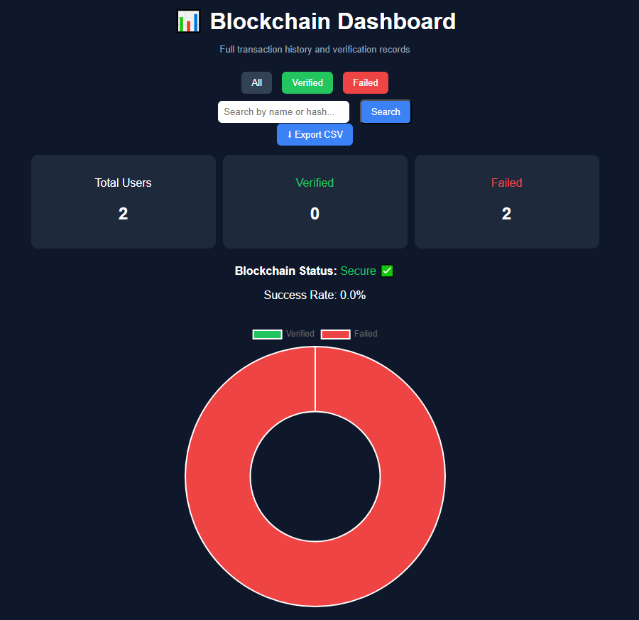

### ❌ Dashboard Filter (Failed Blocks)
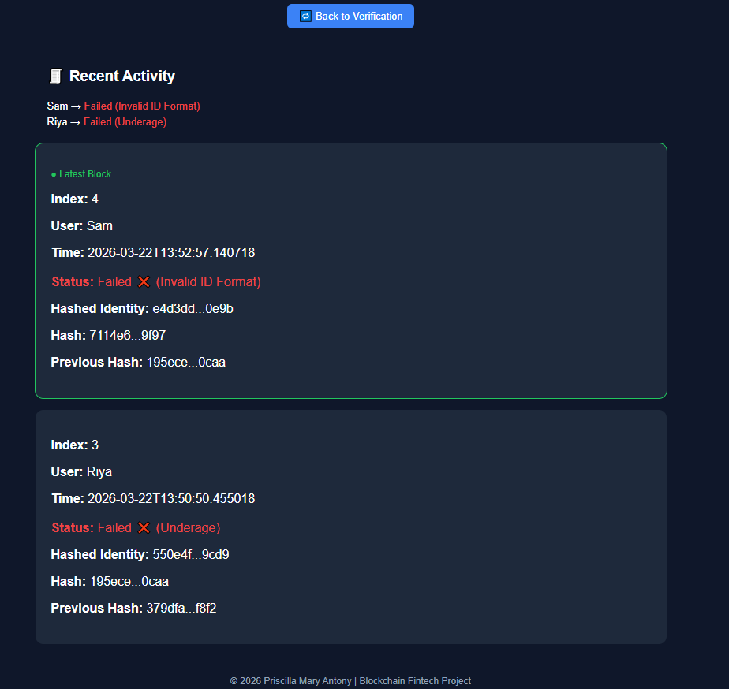

### 🔍 Search Feature (User Input)
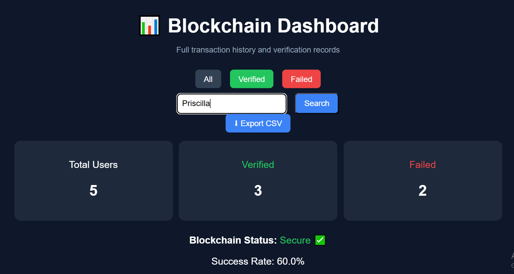

### 🔎 Search Output (Filtered Results)
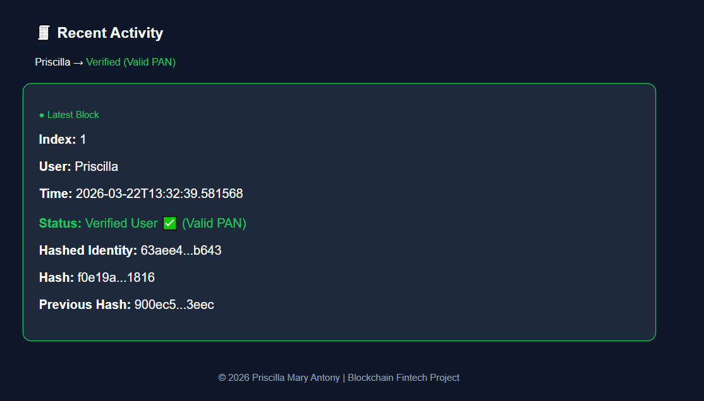

### 🔐 Admin Login Page
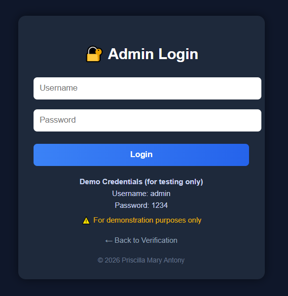

## 🚀 How to Run

bash
git clone <your-repo-link>
cd project-folder
pip install -r requirements.txt
python app.py

Open in browser:

http://127.0.0.1:5000

## 🔑 Demo Credentials

Username: admin
Password: 1234

⚠️ *For demonstration purposes only*

## ☁️ Deployment

- Deployed using Render
- Easily scalable to cloud platforms

## 🚀 Future Enhancements

- Secure authentication (password hashing + sessions)
- Advanced cryptographic techniques
- Proof of Work (PoW) / mining simulation
- Multi-node blockchain architecture
- Extended API integrations

## 👩‍💻 Author

**Priscilla Mary Antony**  
© 2026